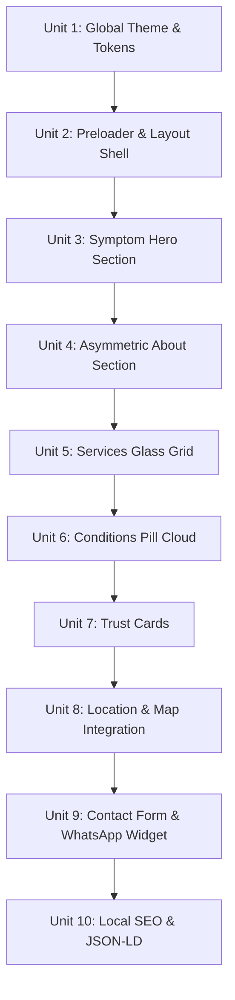

# Build Plan: Dr. Sona Gupta's Luxury Portfolio

This build plan outlines the sequential phases and discrete **Build Units** required to build Dr. Sona Gupta Deb Purkayastha's personal website. Each unit is a single, scoped, and verifiable piece of work designed to prevent vibe-coding drift.

---

## Roadmap Overview

---

## Build Units

### Unit 1: Global Theme & Style Integration
*   **Goal:** Configure CSS Custom Properties (Teal Lux gradients, glow variables, glass overlays) and Google Font families (Outfit, Inter) inside Next.js global styles.
*   **Tasks:**
    *   Set up Tailwind theme configuration or CSS Custom variables in `app/globals.css`.
    *   Verify loading of Google Fonts (Outfit / Plus Jakarta Sans & Inter) inside `app/layout.tsx`.
*   **Dependencies:** None.
*   **Verification:** Ensure no compiler errors on run, font family inspector confirms fonts are active, and base background matches Midnight `#06151C`.

### Unit 2: Cinematic Entrance Preloader & Layout Shell
*   **Goal:** Build the dynamic dark entrance loader animating soundwave SVGs using Framer Motion, transition smoothly to the sticky glassmorphic navigation header and footer shell.
*   **Tasks:**
    *   Create `components/sections/preloader.tsx` utilizing Framer Motion's `AnimatePresence`.
    *   Create `components/shared/navbar.tsx` featuring scroll opacity trackers and a mobile drawer menu.
    *   Integrate preloader state in `app/page.tsx`.
*   **Dependencies:** Unit 1.
*   **Verification:** Preloader runs on initial load/refresh for 2s, displays fading soundwaves and doctor branding, fades out cleanly, and transitions into page layout without shift.

### Unit 3: Symptom-Inspired Hero Section
*   **Goal:** Implement the luxury hero section featuring a large bold tagline, subtext pills, professional RCI badges, primary CTAs, and a premium visual audiology/speech illustration or photo frame.
*   **Tasks:**
    *   Create `components/sections/hero.tsx` with asymmetrical text and custom graphic columns.
    *   Configure Framer Motion entrance sweeps for title and buttons.
    *   Add premium soundwave SVG trace element.
*   **Dependencies:** Unit 2.
*   **Verification:** Single `<h1>` tag active, correct Outfit display typography, CTAs hover/scale cleanly, and RCI tag pills display.

### Unit 4: Asymmetric About Bio Section
*   **Goal:** Create a clean, asymmetrical, multi-column bio layout displaying Dr. Sona's professional profile, academic credentials, and core medical approach in high-contrast glass callout badges.
*   **Tasks:**
    *   Create `components/sections/about.tsx` with responsive layout columns.
    *   Write bio text and credential pills displaying placeholder values.
*   **Dependencies:** Unit 3.
*   **Verification:** Fully responsive rendering on desktop (columns) and mobile (stacked), with clean viewport entrance slide-ups.

### Unit 5: Services Glass Grid
*   **Goal:** Build a floating 3x2 glassmorphic grid displaying the 6 audiology & speech therapy clinical offerings, complete with premium Lucide icons and hover lifting glows.
*   **Tasks:**
    *   Create `components/sections/services.tsx` and structure services configuration array.
    *   Design service glassmorphic card component with background blur and thin white border.
*   **Dependencies:** Unit 4.
*   **Verification:** Cards lift (`scale(1.02)`) and borders glow in bright cyan on mouse hover. Displays correctly on mobile in a single column.

### Unit 6: Conditions Treated Pill Cloud
*   **Goal:** Implement the interactive tags cloud displaying the symptoms and clinical conditions Dr. Sona treats, categorized for rapid patient self-identification.
*   **Tasks:**
    *   Create `components/sections/conditions.tsx`.
    *   Populate responsive pills displaying symptoms like speech delay, hearing loss, stuttering.
*   **Dependencies:** Unit 5.
*   **Verification:** Visual alignment of pills, organic layout wraps, and interactive scale states on hover.

### Unit 7: Trust Cards (Why Choose Dr. Sona)
*   **Goal:** Build high-fidelity calling panels illustrating her primary trust signals (RCI registration, hospital affiliation, multi-age care, region focus) with custom highlight iconography.
*   **Tasks:**
    *   Create `components/sections/trust-signals.tsx` with detailed metric tiles.
*   **Dependencies:** Unit 6.
*   **Verification:** Multi-column layout handles tablets (2x2 grid) and mobile (stacked) properly.

### Unit 8: Google Maps & Location Block
*   **Goal:** Display clinic logistical details, operational hours, Valley Hospital details, and embed a fully responsive, clean interactive Google Map frame.
*   **Tasks:**
    *   Create `components/sections/location.tsx` split layout.
    *   Integrate interactive Google Maps iframe with customized border radii.
*   **Dependencies:** Unit 7.
*   **Verification:** Map loads and remains responsive to zoom/pan. Clinic coordinates match Meherpur, Silchar.

### Unit 9: Contact Form & WhatsApp Widget
*   **Goal:** Construct the luxury callback/appointment request form powered by Formspree, and build a floating glass-green WhatsApp direct click-to-chat widget.
*   **Tasks:**
    *   Create `components/sections/contact-form.tsx` with name, phone, age, concern dropdown, and custom message fields.
    *   Write form client-side input validations and wire API handlers.
    *   Create floating WhatsApp widget anchored to screen edge.
*   **Dependencies:** Unit 8.
*   **Verification:** Inputs validate correctly, show visual errors on empty/wrong digits, submit payload successfully, and the WhatsApp button opens with pre-filled message text.

### Unit 10: Local SEO, JSON-LD Schema, & Production Build
*   **Goal:** Set up index parameters, robots.txt, sitemap.xml, OpenGraph previews, and embed structured Physicians/MedicalBusiness JSON-LD data.
*   **Tasks:**
    *   Configure metadata in layouts and write dynamic schema injections.
    *   Run build commands to ensure zero TypeScript or ESLint errors.
*   **Dependencies:** All prior units.
*   **Verification:** Running local audit tools shows Lighthouse Score 90+, sitemap.xml generates, and JSON-LD resolves correctly.
